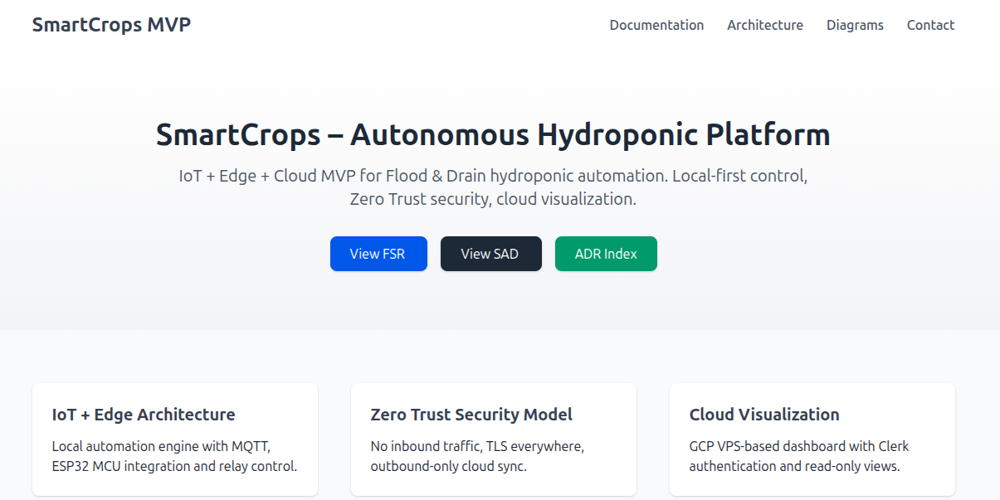

# **SmartCrops – Technical Documentation (MVP Blueprint)**

### *Hydroponic Automation Platform — Technical Architecture Package*

**Status:** Pre-Development / Architecture Completed.
**Audience:** CTO, Solutions Architects, IoT Engineers, Hardware Engineers, Cloud Architects, PMO, Technical Leads

---

# **Table of Contents**
- [1. Overview](#1-overview)
- [2. Scope (MVP Pre-Development)](#2-scope-mvp-pre-development)
- [3. Included Deliverables](#3-included-deliverables)
  - [3.1 Functional Specification Requirements (FSR)](#31-functional-specification-requirements-fsr)
  - [3.2 Solution Architecture Document (SAD)](#32-solution-architecture-document-sad)
  - [3.3 Architecture Decision Records (ADR)](#33-architecture-decision-records-adr)
  - [3.4 Architecture Diagrams Package](#34-architecture-diagrams-package)
- [4. Architecture Summary](#4-architecture-summary)
- [5. Project Status (Pre-Development)](#5-project-status-pre-development)
- [6. Next Phase: Development](#6-next-phase-development)
- [7. GitHub Pages Mini-Site](#7-github-pages-mini-site)
- [8. Contact](#8-contact)

---

# **1. Overview**

SmartCrops is a modern IoT and Edge Computing platform designed to deliver fully autonomous Flood & Drain hydroponic automation with enterprise-grade reliability. The system combines a hardware abstraction layer powered by an ESP32 microcontroller with a containerized Fastify backend, enabling precise control of irrigation cycles, nutrient monitoring, climate thresholds, and safety protections—whether online or offline.

At its core, SmartCrops follows a Local-First Architecture, ensuring all operational logic, data processing, and fail-safe routines run entirely on-premise. Real-time sensor data (pH, EC, temperature, humidity, water level) is collected through mixed buses (UART, I2C, 1-Wire) and distributed via an MQTT event-driven pipeline. A PostgreSQL time-series store retains multi-year historical telemetry, optimized for high-frequency ingestion.

For remote visibility, SmartCrops integrates an optional read-only cloud dashboard, where data is synchronized using an outbound-only WebSocket channel following Zero Trust principles. This provides secure analytics and monitoring without exposing local infrastructure or enabling remote actuation.

This repository includes the full MVP Pre-Development Technical Package —FSR, SAD, ADRs, and C4 diagrams— defining a complete, validated architecture ready for implementation across firmware, backend, frontend, and DevOps layers.

SmartCrops demonstrates a balanced approach between engineering rigor and practical agricultural automation, providing a scalable foundation for future AI-powered analytics and multi-installation support. 

### **Referenced Documentation**
- FSR: [`/docs/FSR/SmartCrops-FSR.md`](./docs/FSR/SmartCrops-FSR.md)
- SAD: [`/docs/SAD/SmartCrops-SAD.md`](./docs/SAD/SmartCrops-SAD.md)
- ADR: [`/docs/ADR/SmartCrops-ADR.md`](./docs/ADR/SmartCrops-ADR.md)
- Diagrams: [`/docs/diagrams/`](./docs/diagrams/)

# **2. Scope (MVP Pre-Development)**

### Deliverables included
- Complete **FSR**
- Full system **SAD**
- All **ADR**
- Architecture diagrams (C4 + IoT + Security + Data Flow)

### Not included
- Source code  
- Firmware  
- Cloud deployment  
- CI/CD pipelines  
- UI final implementation  

# **3. Included Deliverables**

## **3.1 Functional Specification Requirements (FSR)**

Defines the *functional* behavior of the SmartCrops MVP.

📄 **Document:** [`/docs/FSR/SmartCrops-FSR.md`](./docs/FSR/SmartCrops-FSR.md)

## **3.2 Solution Architecture Document (SAD)**

Defines *how the system is implemented*.

📄 **Document:** [`/docs/SAD/SmartCrops-SAD.md`](./docs/SAD/SmartCrops-SAD.md)

## **3.3 Architecture Decision Records (ADR)**

Justifies each major architectural choice.

📄 **Index:** [`/docs/ADR/ADR-INDEX.md`](./docs/ADR/ADR-INDEX.md)

## **3.4 Architecture Diagrams Package**

📁 **Folder:** [`/docs/diagrams/`](./docs/diagrams/)

Included ASCII diagrams:
1. `/docs/diagrams/01-context.md`
2. `/docs/diagrams/02-containers.md`
3. `/docs/diagrams/03-components-backend.md`
4. `/docs/diagrams/04-iot-hardware.md`
5. `/docs/diagrams/05-security-network.md`
6. `/docs/diagrams/06-dataflow.md`

# **4. Architecture Summary**

SmartCrops adopts a **Local-First Autonomous Architecture**, running all operational logic on the Edge device.

```
Sensors → ESP32 → MQTT → Edge Backend → PostgreSQL → Local UI
                                             ↓
                                     Outbound Sync
                                             ↓
                           Cloud Backend → Cloud DB → Dashboard
```

📄 Full details: [`/docs/SAD/SmartCrops-SAD.md`](./docs/SAD/SmartCrops-SAD.md)


# **5. Project Status (Pre-Development)**

✔ Technical documentation completed. 
✔ Architecture validated.
✔ Landing page running developed and deployed.

# **6. Next Phase: Development**

Upcoming tasks:
- ESP32 firmware  
- Fastify backend  
- PostgreSQL schemas  
- MQTT broker  
- Local UI (Next.js)  
- Cloud sync service  
- DevOps baseline  

📄 Recommended workflow: `/docs/SAD/SmartCrops-SAD.md#devops-architecture`

# **7. GitHub Pages**

To improve navigation during the Pre-Development phase, a **lightweight documentation website** was developed using **GitHub Pages**.  
This site enables:

- Fast navigation between FSR, SAD, ADR and diagrams.  
- Clean portfolio-ready layout.  
- Visual access to architecture diagrams.

### **Preview**



### **Visit the Page at...**
👉 *https://dev-mikel.github.io/smartcrops*

# **8. Contact**

**Author:** Miguel Ladines  
**Role:** IoT & Hardware Engineer  
**Email:** ladinesmiguel770@gmail.com  
**LinkedIn:** https://linkedin.com/in/ladinesmiguel 
**GitHub:** https://github.com/dev-mikel

---
