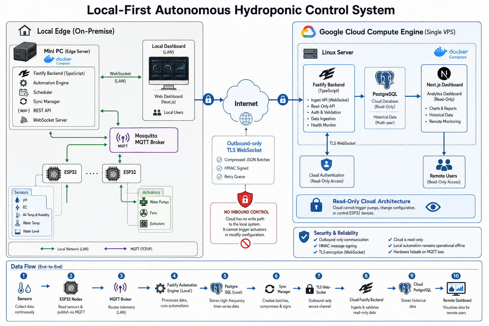
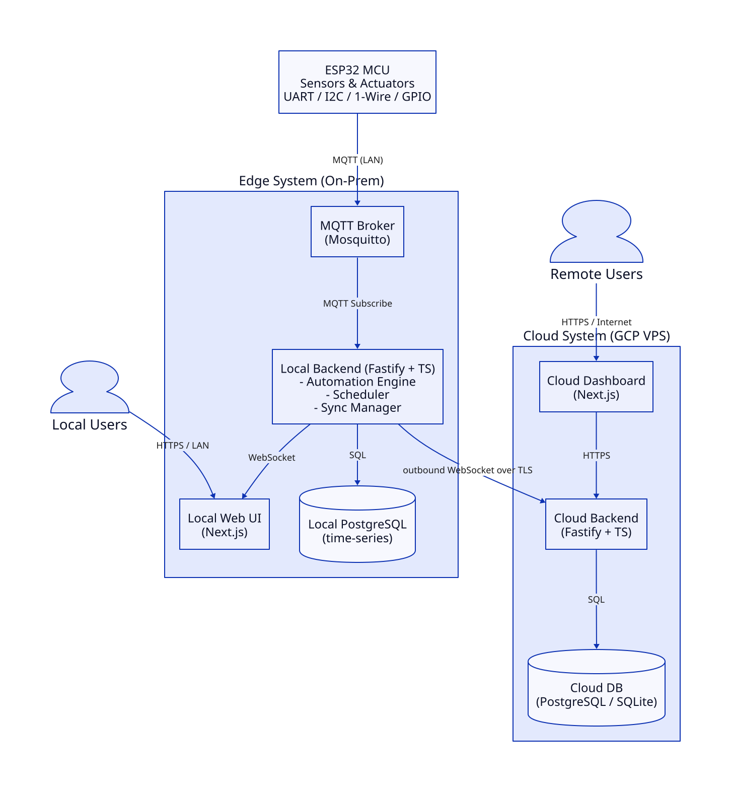
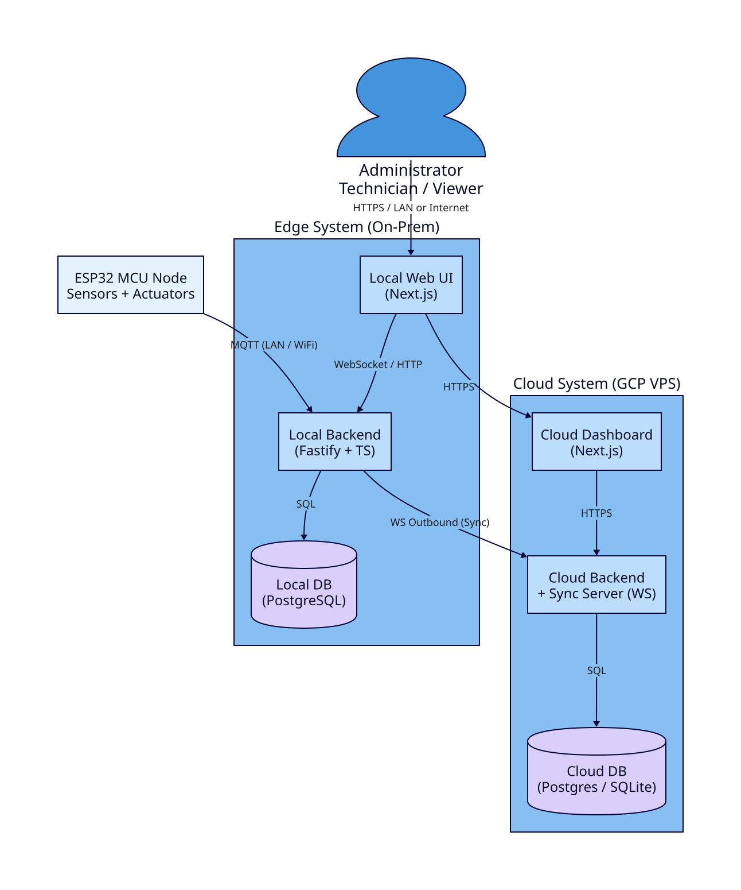
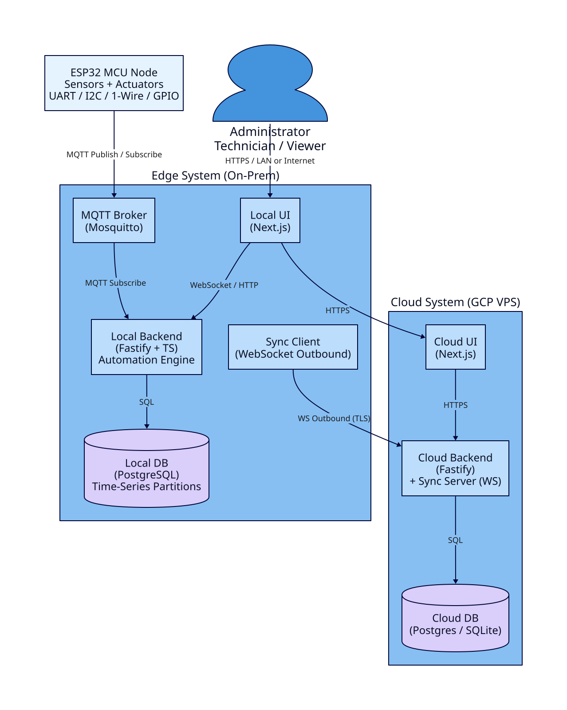
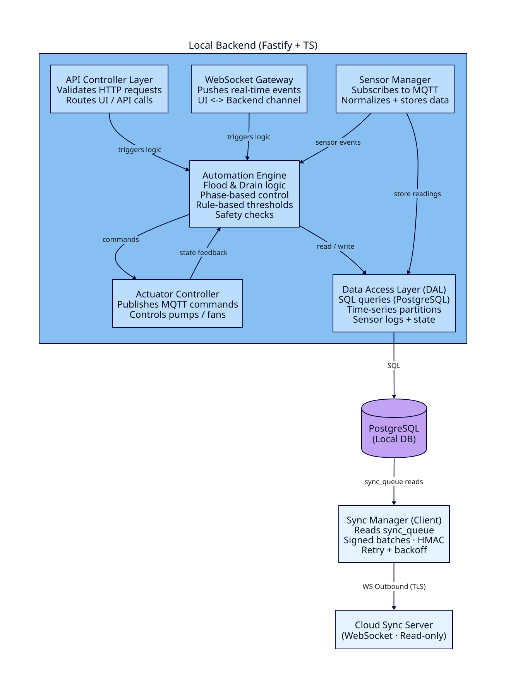
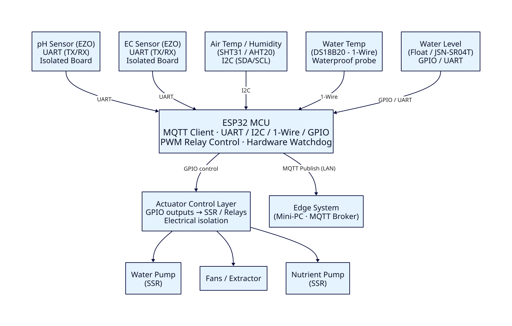
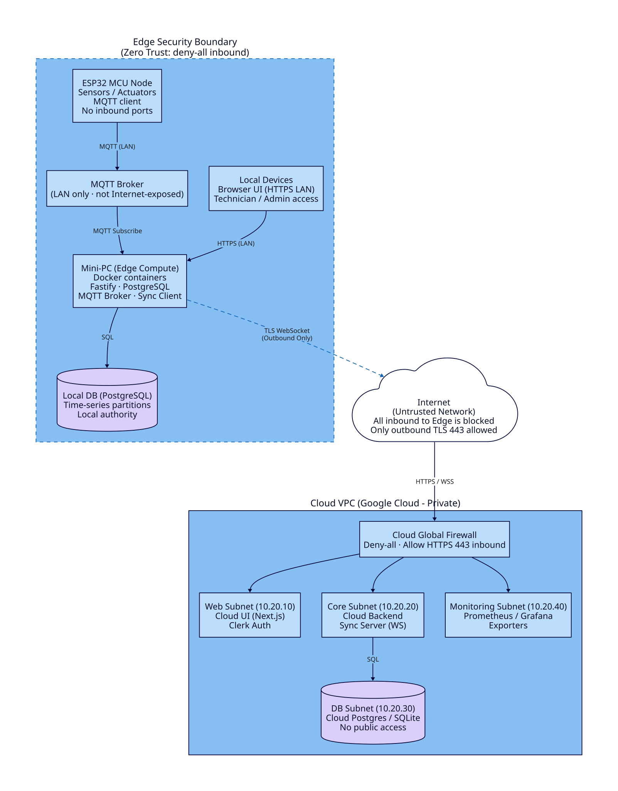
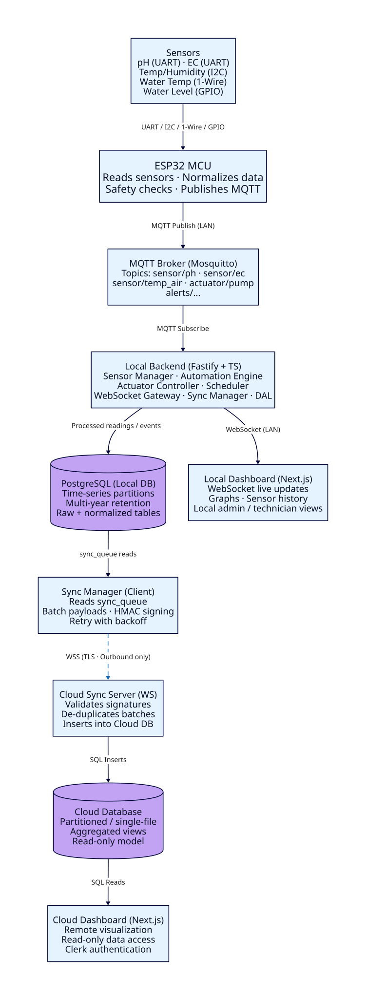

<h1 align="center">🌱 Autonomous Hydroponic Control System — Architecture Engineering Case Study</h1>

<p align="center"><em>Local-first IoT platform architecture for autonomous Flood & Drain hydroponic growing — FSR, SAD, ADRs, and six C4 diagrams.</em></p>

<p align="center">
  
  
  
  
  
  
  
  
  
  
</p>

---



## Table of Contents

1. [Overview](#1-overview)
   - [1.1 The problem](#11-the-problem)
   - [1.2 What it does](#12-what-it-does)
   - [1.3 Key features](#13-key-features)
2. [Walkthrough](#2-walkthrough)
   - [2.1 C4 Architecture Diagrams](#21-c4-architecture-diagrams)
3. [Architecture](#3-architecture)
   - [3.1 Data flow](#31-data-flow)
   - [3.2 Components](#32-components)
   - [3.3 Key decisions](#33-key-decisions)
   - [3.4 Scope and phase plan](#34-scope-and-phase-plan)
4. [Tech stack](#4-tech-stack)
5. [Deliverables](#5-deliverables)
6. [Project structure](#6-project-structure)
7. [Author](#7-author)

## 1. Overview

### 1.1 The problem

Commercial Flood & Drain hydroponic systems require simultaneous, uninterrupted control across three domains: irrigation timing tied to crop growth stage, continuous pH and electrical conductivity (EC) monitoring, and climate enforcement. Off-the-shelf controllers offer no path for long-term telemetry retention or custom automation logic, while cloud-dependent platforms halt entirely on connectivity loss — unacceptable in a safety-critical, crop-threatening environment.

### 1.2 What it does

- Runs all control logic, sensor processing, and safety routines on-premise with zero internet dependency
- Ingests pH, EC, air temperature, water temperature, and water level into a single event-driven automation loop via MQTT
- Executes Flood & Drain cycles that adapt automatically to the active crop growth phase
- Stores multi-year, high-frequency sensor readings in a partitioned PostgreSQL time-series table
- Pushes compressed, HMAC-signed batches to a read-only cloud dashboard over an outbound-only TLS WebSocket
- Enforces a hardware-level safety boundary: the cloud has no write path back to the local system

### 1.3 Key features

- **Local-first autonomy** — full control loop runs offline; internet loss does not interrupt automation
- **Phase-aware irrigation** — Flood & Drain schedules reconfigure automatically on growth phase transition (Vegetative → Pre-Flowering → Fruiting)
- **Unified sensor pipeline** — five sensor types over UART, I2C, 1-Wire, and GPIO, routed through a single MQTT event bus
- **Multi-year telemetry** — monthly-partitioned PostgreSQL handles millions of high-frequency readings per year on consumer-grade edge hardware
- **Secure remote visibility** — cloud dashboard is read-only; enforced architecturally, not only by policy
- **Safety-grade failsafes** — ESP32 firmware runs independent watchdog and failsafe routines; actuators enter safe state on MQTT connectivity loss

## 2. Walkthrough

This repository is Phase I of the SmartCrops platform: the complete pre-development architecture package. The deliverable is six C4 model diagrams plus a full FSR, SAD, and ADR set — not running source code. The diagrams below are the committed design outputs.

### 2.1 C4 Architecture Diagrams

**High-level Architecture Overview**



**System Context (C4 L1)**



**Container Architecture (C4 L2)**



**Backend Components (C4 L3)**



**IoT Hardware Topology**



**Security & Network Architecture**



**Data Flow**



## 3. Architecture

### 3.1 Data flow

1. ESP32 publishes sensor events → MQTT Broker (LAN)
2. Local backend subscribes to MQTT, runs automation engine, persists telemetry to PostgreSQL
3. Local backend streams live state to the local web UI over WebSocket
4. Sync Manager queues outbound payloads and sends HMAC-signed compressed JSON batches to the cloud backend over TLS WebSocket (outbound only)
5. Cloud dashboard surfaces historical data to remote users (read-only)

The cloud has no inbound path to the local system. It cannot trigger actuators or modify configuration — enforced at both the network and application layers, following ICS/SCADA outbound-only principles.

### 3.2 Components

**ESP32 sensor and actuator node**

- Sole hardware interface to the physical environment
- Sensor inputs: pH and EC via UART; air temperature and humidity (SHT31/AHT20) via I2C; water temperature (DS18B20) via 1-Wire; water level via GPIO
- Actuator outputs: pumps, fans, and extractors via solid-state relays
- Runs independent watchdog and failsafe firmware; actuators enter safe state on MQTT connectivity loss
- Rationale over USB sensors on Mini-PC: electrical isolation from high-current circuits and real-time determinism that a general-purpose OS cannot guarantee

**Local backend (Fastify + TypeScript)**

Modular monolith on the Mini-PC — all modules share a single process:

- **Automation Engine** — evaluates sensor thresholds, triggers actuator commands, enforces growth-phase parameters
- **Scheduler** — manages phase-aware Flood & Drain irrigation cycles
- **Sync Manager** — queues outbound payloads, delivers with retry and exponential backoff
- **REST / WebSocket API** — serves the local web UI over LAN

Rationale over microservices: deterministic event sequencing within one process; no inter-service network overhead; no Kubernetes orchestration justified at single-rig scope.

**MQTT event bus (Mosquitto)**

Decoupling layer between the timing-sensitive ESP32 firmware and the backend:

| Topic | Direction | Purpose |
|-------|-----------|---------|
| `sensors/ph`, `sensors/ec`, `sensors/temp_air`, `sensors/temp_water`, `sensors/level` | ESP32 → Backend | Sensor readings |
| `actuators/#` | Backend → ESP32 | Actuator commands |
| `system/events` | Both | System diagnostics |

**Data layer (PostgreSQL)**

Monthly-partitioned `sensor_readings` table plus relational tables for irrigation cycles, actuator events, calibration records, maintenance events, and the outbound `sync_queue`. Rationale over InfluxDB/TimescaleDB: no additional operational overhead at single-installation MVP scale.

**Cloud visualization layer (Google Cloud Compute Engine)**

Single VPS running a Fastify backend, Next.js dashboard, and PostgreSQL (SQLite as resource-constrained fallback). Receives compressed, HMAC-signed batches via TLS WebSocket; acknowledges receipt; exposes read-only REST endpoints scoped per installation.

### 3.3 Key decisions

| Decision | Chosen | Discarded | Reason |
|----------|--------|-----------|--------|
| Backend architecture | Modular monolith (Fastify + TS) | Microservices | Deterministic latency on edge hardware; no Kubernetes overhead for single-rig scope |
| MCU | ESP32 | USB sensors on Mini-PC / RPi GPIO | Electrical isolation for pH/EC circuits; dedicated real-time firmware |
| Internal messaging | Mosquitto MQTT | HTTP polling, CoAP | MCU-native, lightweight; QoS guarantees; decouples firmware from backend timing |
| Local database | PostgreSQL (monthly partitions) | InfluxDB, TimescaleDB, SQLite | No additional tech overhead; Docker Compose compatible; partitioning sufficient for MVP scale |
| Cloud sync | Outbound-only WebSocket | REST polling, bidirectional WS | Enforces one-way data flow; cloud cannot trigger local actuators |
| Cloud auth | Clerk (OAuth2) | Custom auth | Multi-installation user management without custom identity infrastructure |
| Deployment | Docker Compose | Kubernetes | Works on a single edge Mini-PC; no orchestrator overhead at MVP scope |

### 3.4 Scope and phase plan

**Phase I — this repository:** pre-development architecture package (FSR, SAD, ADR, C4 diagrams). No source code.

**Phase II (deferred):**

- AI-based predictive analytics
- Multi-installation management per site
- Remote OTA firmware updates for ESP32
- High-availability deployment (load balancers, Kubernetes)
- Role federation between local and cloud identity systems

## 4. Tech stack

| Layer | Technology | Why this over alternatives |
|-------|-----------|---------------------------|
| Edge hardware | ESP32 MCU | Electrical isolation from high-current circuits; dedicated real-time firmware; built-in WiFi and MQTT client |
| Backend (local & cloud) | Fastify + TypeScript | Low-latency REST and WebSocket on minimal resources; TypeScript enforces module contracts; shares tooling with Next.js |
| Frontend (local & cloud) | Next.js | Shared component patterns across local and cloud UIs; SSR for cloud-hosted pages, CSR for local real-time dashboard |
| Message broker | Mosquitto MQTT | Industry-standard IoT messaging; lightweight enough for ESP32; QoS guarantees for sensor events |
| Database (local) | PostgreSQL | Monthly-partitioned time-series tables; relational integrity for irrigation and calibration logs; Docker Compose compatible |
| Database (cloud) | PostgreSQL / SQLite | Mirrors local schema for read-only queries; SQLite available as fallback on resource-constrained VPS |
| Cloud infrastructure | Google Cloud Compute Engine | Single VPS sufficient for MVP read-only dashboard; no managed services or load balancers at this scale |
| Auth (local) | Basic auth (local credential store) | Must function fully offline; Clerk requires internet connectivity |
| Auth (cloud) | Clerk (OAuth2) | Multi-user, multi-installation access management; no custom identity infrastructure |
| Containerization | Docker + Docker Compose | Runs on both edge Mini-PC and cloud VPS; no Kubernetes overhead at single-rig MVP scope |
| Logging | Pino (structured JSON) | Low-overhead structured output for audit trails; native to the Fastify ecosystem |
| Metrics | Prometheus + Node Exporter | Self-hosted observability; integrates with optional Grafana on the VPS |

## 5. Deliverables

Pre-development architecture package — no source code. All documents are directly readable in this repository.

| Document | Path | Description |
|----------|------|-------------|
| Functional Specification Requirements (FSR) | [`docs/SmartCrops-FSR.md`](./docs/SmartCrops-FSR.md) | Functional behavior, actor roles, use cases, business rules, and textual wireframes |
| Solution Architecture Document (SAD) | [`docs/SmartCrops-SAD.md`](./docs/SmartCrops-SAD.md) | Full architectural specification — logical, physical, data, security, integration, and DevOps layers; C4 diagrams at all three levels |
| Architecture Decision Records (ADR) | [`docs/SmartCrops-ADR.md`](./docs/SmartCrops-ADR.md) | Rationale for each major architectural choice, alternatives considered, and accepted consequences |
| C4 Diagrams (SVG) | [`public/`](./public/) | Rendered diagrams: system context, containers, backend components, IoT hardware topology, security network, and data flow |

## 6. Project structure

```
smartcrops/
├── public/
│   ├── architechture-smartcrops.png # Cover — architecture overview
│   ├── 00-highlevel.svg             # High-level architecture overview
│   ├── 01-context.svg               # C4 L1 — System Context
│   ├── 02-containers.svg            # C4 L2 — Container Architecture
│   ├── 03-components-backend.svg    # C4 L3 — Backend Components
│   ├── 04-iot-hardware.svg          # IoT Hardware Topology
│   ├── 05-security-network.svg      # Security & Network Architecture
│   └── 06-dataflow.svg              # Data Flow
├── docs/
│   ├── SmartCrops-ADR.md            # Architecture Decision Records (14 ADRs)
│   ├── SmartCrops-FSR.md            # Functional Specification Requirements
│   └── SmartCrops-SAD.md            # Solution Architecture Document
├── LICENSE
└── README.md
```

## 7. Author

**Miguel Ladines** · [@dev-mikel](https://github.com/dev-mikel)  
Electronics Engineer · AI Developer | Automation & Systems Integration
